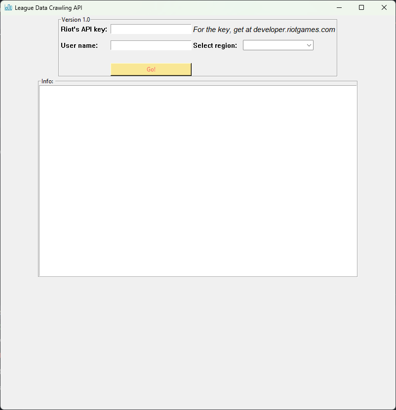

### League of Legends Match / Summoner data fetcher using RIOT's API

# Version 1.1 update
* Fix result screen -> read-only state.
* 

# Version 1.0 update 
- BETA user interface
- Features:
    - Search by summoner's username.
    - Return ID, PUUID (global Riot's ID), levels,...

***

# Acknowledgement
**What's for?** : Fun

**What's next?**: IDK, ping if me you know anything useful with this.

**Version**: Maybe beta of beta, haven't even made it a GUI (too lz).

**Feedback**: Would like to receive any fun ideas with those dull stats.

**How to run it?**: Run mainUI.py for finding summoner's profile data.